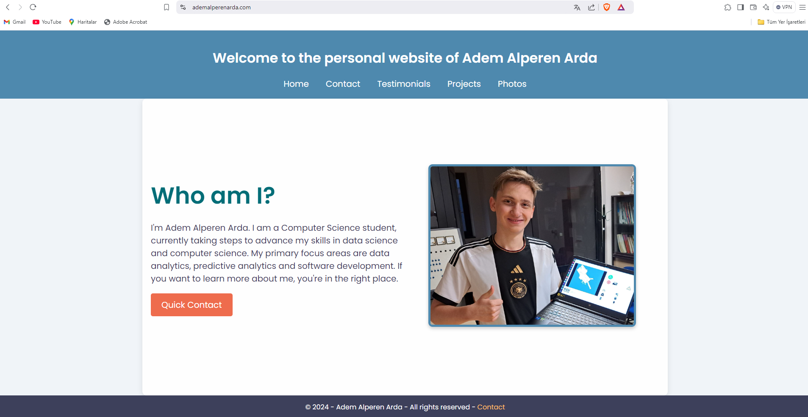
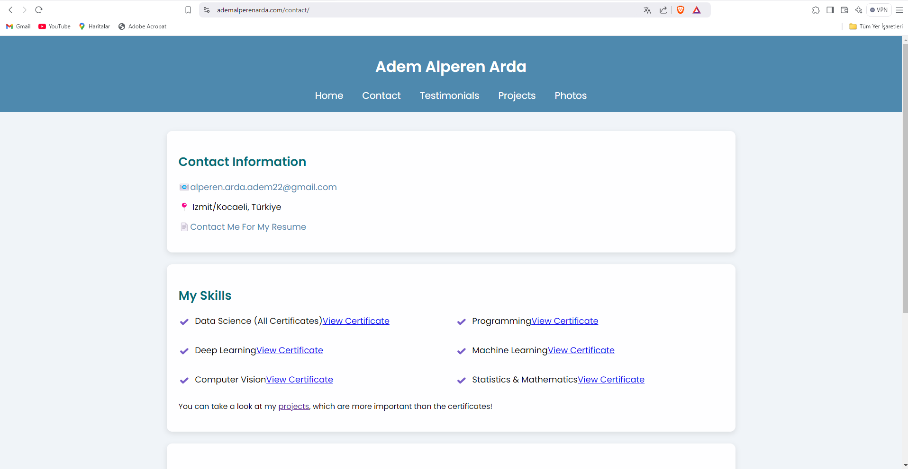
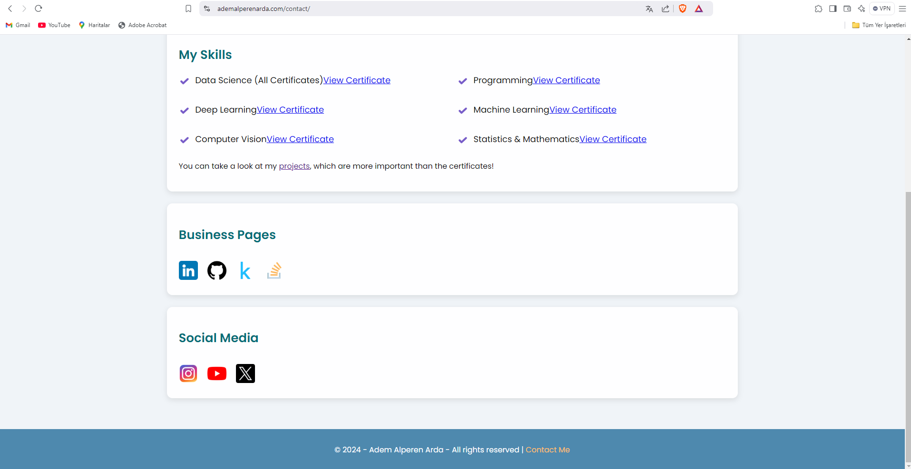
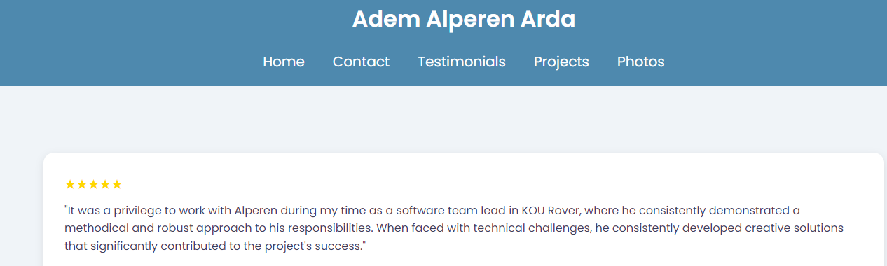
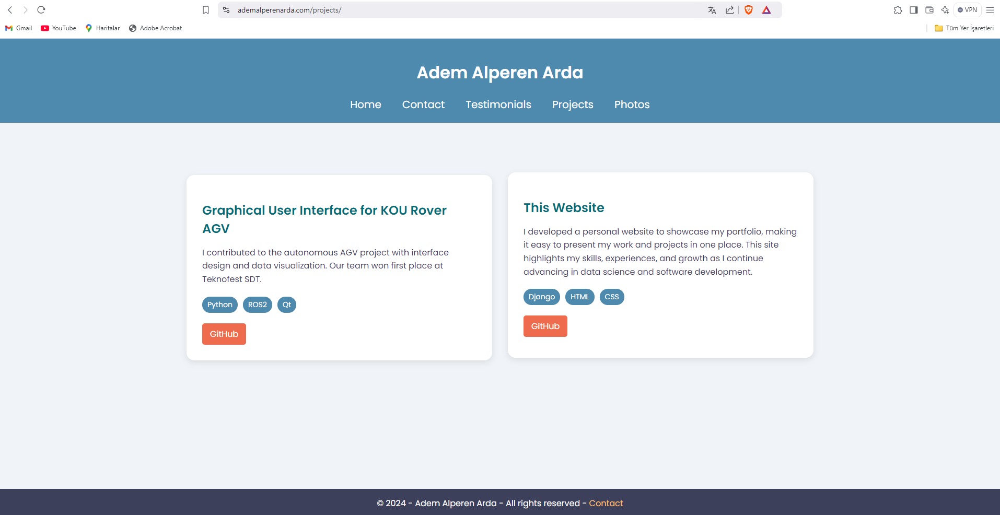
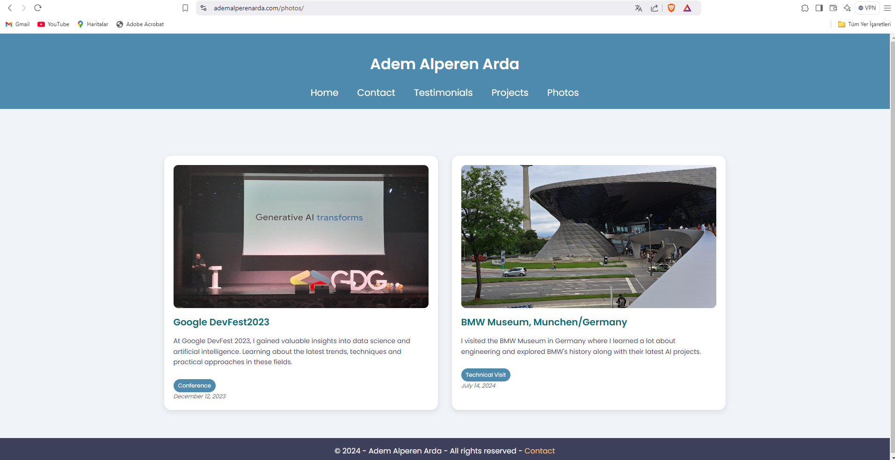

# The Personal Website of Adem Alperen Arda - www.ademalperenarda.com

This repository contains the code for my personal website, where I showcase my portfolio, skills, projects and professional achievements.

---

*Main Page*
---

## 🌟 About

I am Adem Alperen Arda, a Computer Science student working on about **Data Science**, **Software Development**, and **Predictive Analytics**. This website serves as a platform to present my work, skills and certifications as I advance in my career.

### Features:
- **Who Am I?**: A brief introduction about me and my areas of expertise.
- **Projects**: A collection of my projects with GitHub links.
- **Skills and Certifications**: A list of my technical skills and certifications.
- **Events and Technical Visits**: Highlights of conferences and technical trips I have attended.
- **Quick Contact**: Easy access to contact me or request my resume.

## 🛠️ Technologies Used

- **Frontend**: HTML, CSS
- **Backend**: Django (Python)

---
## Photos

*Contact page and certificates*

*Social media links in contact page*

*Testimonials page where my colleagues or teammates can share their feedback about me.*

*My projects page. Also you can see those projects on my Github.*

*Photos page where I sometimes share my technical trips or conferences.*
---

## 📜 License

This project is open source and available under the [MIT License](LICENSE).

---

Feel free to reach out or explore the website for more information!
